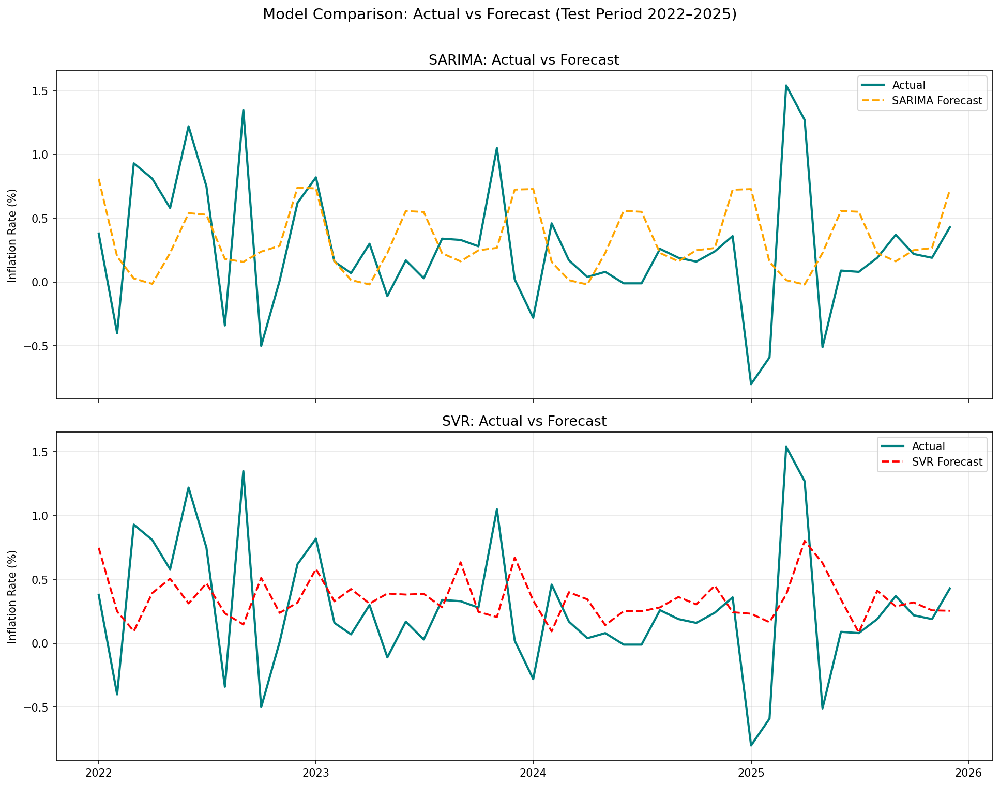

# Inflation Rate Forecasting — Bandar Lampung
### Comparing SARIMA and SVR for Monthly Inflation Prediction (2006–2025)


---

## What is this project about?

This project tries to answer a simple question:
> *"Can we predict next month's inflation rate in Bandar Lampung — and which algorithm does it better?"*

Two approaches are compared:
- **SARIMA** — a classical statistical model designed for seasonal time series
- **SVR** (Support Vector Regression) — a machine learning model that handles non-linear patterns

---

## Dataset

| | |
|---|---|
| **Source** | [BPS Provinsi Lampung](https://lampung.bps.go.id/en/statistics-table/2/MSMy/laju-inflasi-kota-bandar-lampung.html) |
| **Period** | January 2006 – December 2025 |
| **Total** | 240 monthly records |

> Data was downloaded year-by-year from BPS and merged programmatically — the integration process is documented in the notebook.

---

## Workflow

```
Data Integration → Preprocessing → EDA → Stationarity Test
→ SARIMA Modeling → SVR Modeling → Evaluation & Comparison
```

---

## Forecast Results



---

## Evaluation

| Metric | SARIMA | SVR |
|--------|--------|-----|
| RMSE | 0.5905 | **0.5146** ✅ |
| SMAPE | 118.10% | **103.43%** ✅ |

**SVR wins on both metrics.**

> *Note: SMAPE is used instead of standard MAPE because the inflation data contains near-zero and negative values (deflation), which cause MAPE to produce unreliably large numbers.*

---

## Key Takeaways

- Bandar Lampung's inflation has a clear **12-month seasonal pattern** — prices tend to spike around Ramadan/Eid and dip after holiday seasons.
- **SARIMA** is stable and interpretable, but too smooth — it misses extreme spikes and deflation events.
- **SVR** adapts better to the non-linear and volatile nature of inflation data.
- Both models still struggle with near-zero values — a known limitation of univariate forecasting on highly volatile data.

---

## Repository Structure

```
├── sarima_svr_inflation_bandar_lampung.ipynb   # Main notebook
├── inflation_bandar_lampung_2006_2025.csv      # Merged dataset
├── images/                                     # All plots
└── README.md
```

---

## Tech Stack

`Python` `pandas` `numpy` `matplotlib` `seaborn` `statsmodels` `pmdarima` `scikit-learn`

---

